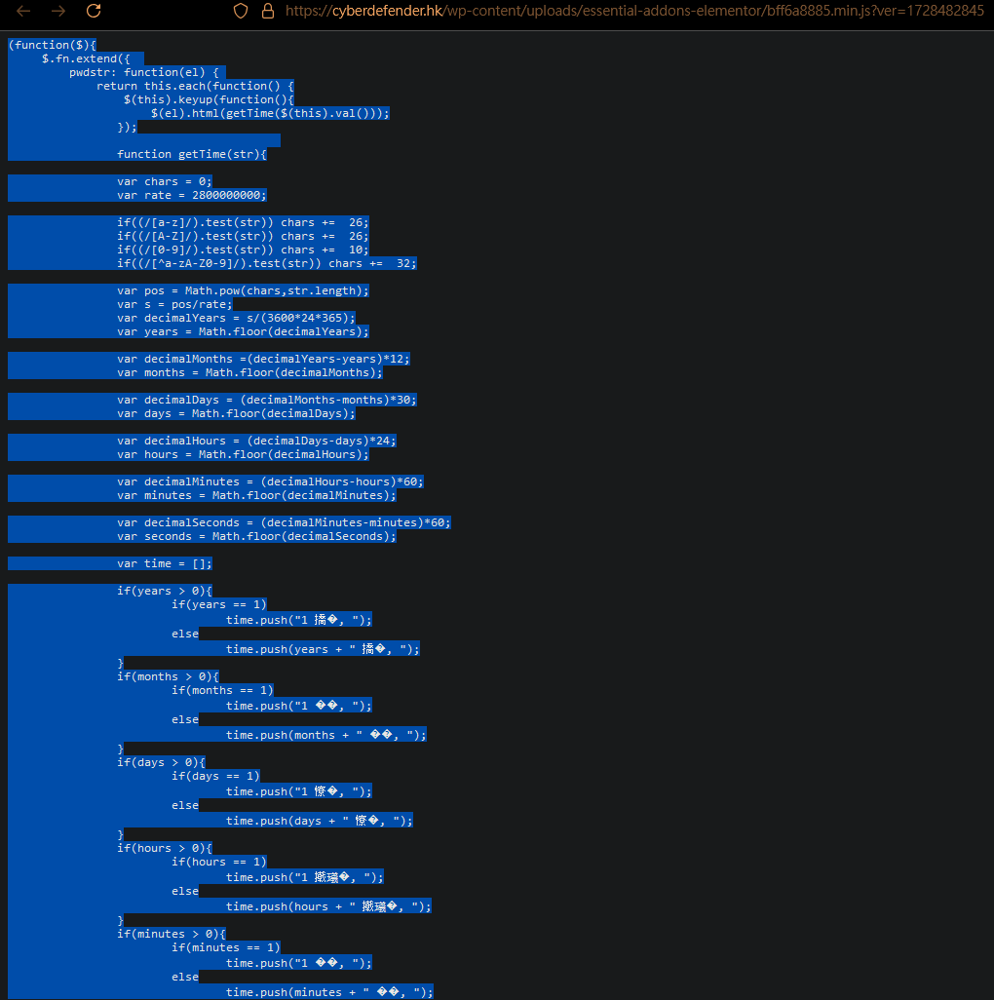
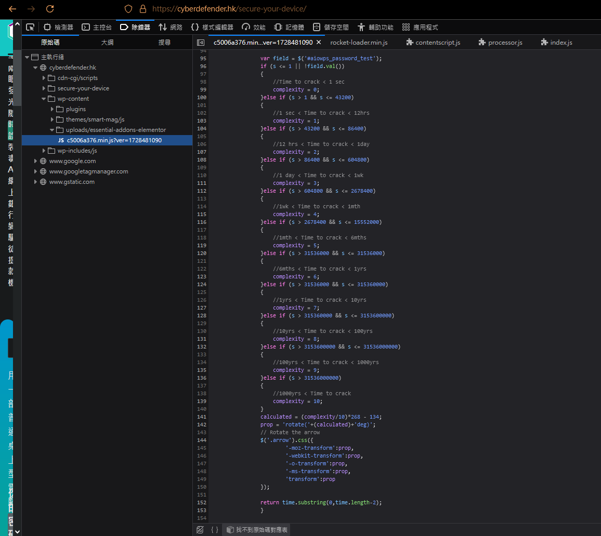

Whoever's writing this BS for checking password-strength for 🇭🇰 Hong Kong government & citizen should quit your job and go jump down to somewhere. Whoever's auditing this crap too pls do the same. 

Website : "[https://cyberdefender.hk/password-strength-tool/](https://cyberdefender.hk/password-strength-tool/)"

Script : "[https://cyberdefender.hk/wp-content/uploads/essential-addons-elementor/c5006a376.min.js?ver=1728481090](https://cyberdefender.hk/wp-content/uploads/essential-addons-elementor/c5006a376.min.js?ver=1728481090)"
"[https://github.com/RemusDBD/cyberdefender/blob/main/c5006a376.ver_1728481090.min.js](https://github.com/RemusDBD/cyberdefender/blob/main/c5006a376.ver_1728481090.min.js)"
